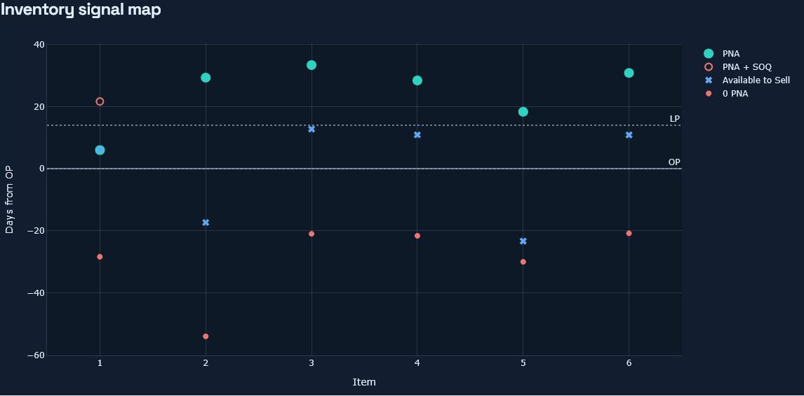

# IMSim

IMSim is a Dash 4 inventory management training app that teaches replenishment concepts step by
step, then unlocks a full simulator for practicing inventory decisions with live feedback.

[](https://github.com/SchmidtCode/IMSim/actions/workflows/ci.yml)
[](https://github.com/SchmidtCode/IMSim/pkgs/container/imsim)
[](LICENSE)
[](https://www.schmidtcode.com/)



## Highlights

- 19-lesson academy path that unlocks the full simulator
- Inventory policy engine for OP, LP, EOQ, OQ, SOQ, pack rounding, and auto-PO behavior
- Daily demand simulation with stockout, holding, expedite, revenue, and COGS tracking
- PostgreSQL-backed or file-backed session persistence behind a shared repository layer
- CSV and XLSX import flow with header normalization and preview validation
- Reproducible local setup with Docker, `uv`, CI, and a tracked `uv.lock`

## Quick Start

You do not need to clone this repo to run IMSim.

Create a new folder, drop in a `docker-compose.yml` and `.env`, and let Docker pull the published
container from GitHub Container Registry.

```bash
mkdir imsim
cd imsim
curl -O https://raw.githubusercontent.com/SchmidtCode/IMSim/main/deploy/docker-compose.yml
curl -O https://raw.githubusercontent.com/SchmidtCode/IMSim/main/deploy/.env.example
cp .env.example .env
docker compose up -d
```

PowerShell:

```powershell
New-Item -ItemType Directory imsim
Set-Location imsim
Invoke-WebRequest https://raw.githubusercontent.com/SchmidtCode/IMSim/main/deploy/docker-compose.yml -OutFile docker-compose.yml
Invoke-WebRequest https://raw.githubusercontent.com/SchmidtCode/IMSim/main/deploy/.env.example -OutFile .env.example
Copy-Item .env.example .env
docker compose up -d
```

Open `http://127.0.0.1:8050/`.

Useful commands:

```bash
docker compose logs -f app
docker compose down
docker compose down -v
```

The container image is:

```text
ghcr.io/schmidtcode/imsim:latest
```

If you want to work from a checked-out source tree as a contributor, use the source-specific
Compose files under `deploy/source/`:

```bash
cp deploy/source/.env.example .env
docker compose -f deploy/source/docker-compose.yml -f deploy/source/docker-compose.build.yml --project-directory . up -d --build
```

For the non-container contributor workflow:

```bash
cp deploy/source/.env.example .env
uv python install 3.14.5
uv sync --group dev
uv run pre-commit install
uv run imsim
```

Pre-commit runs Ruff before commits and pytest before pushes. To run the hooks manually:

```bash
uv run pre-commit run --all-files
uv run pre-commit run --hook-stage pre-push --all-files
```

For a shared homelab deployment, set `IMSIM_ADMIN_TOKEN` in `.env` before you expose the app.
If you want the `uv run` workflow or source checkout instructions, jump to the docs below.

## Public Deployment Notes

- Change the default PostgreSQL password and set a long random `IMSIM_ADMIN_TOKEN` before go-live.
- Keep the IMSim origin private if possible. The bundled Compose file binds the app to
  `127.0.0.1:8050` so you can place a local reverse proxy or `cloudflared` in front of it.
- Prefer Cloudflare Tunnel or another private-origin setup over directly port-forwarding the app.
- If you upload spreadsheets from the public UI, keep the upload limit modest with
  `IMSIM_MAX_UPLOAD_BYTES`.

## Docs

- [Getting Started](docs/getting-started.md)
- [Deployment](docs/deployment.md)
- [Development](docs/development.md)
- [Reference](docs/reference.md)

## Example Data

- `examples/sample-items.csv`
- `examples/Example.xlsx`

## Disclaimer

IMSim is an independent open-source inventory management training project. It is not affiliated
with, endorsed by, sponsored by, or supported by Infor. Product names such as Infor,
CloudSuite Distribution, CSD, and Distribution SX.e are referenced only to help users map
general inventory concepts to systems they may use.

## License

Apache-2.0. See `LICENSE`.
